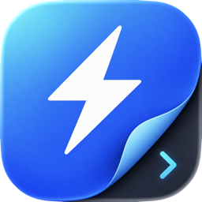
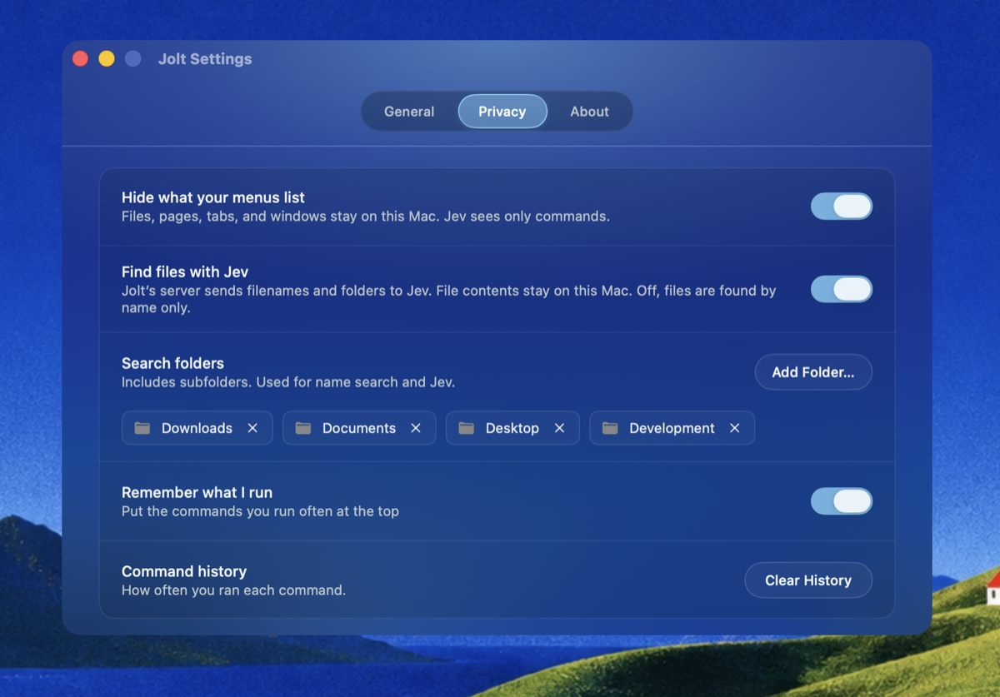
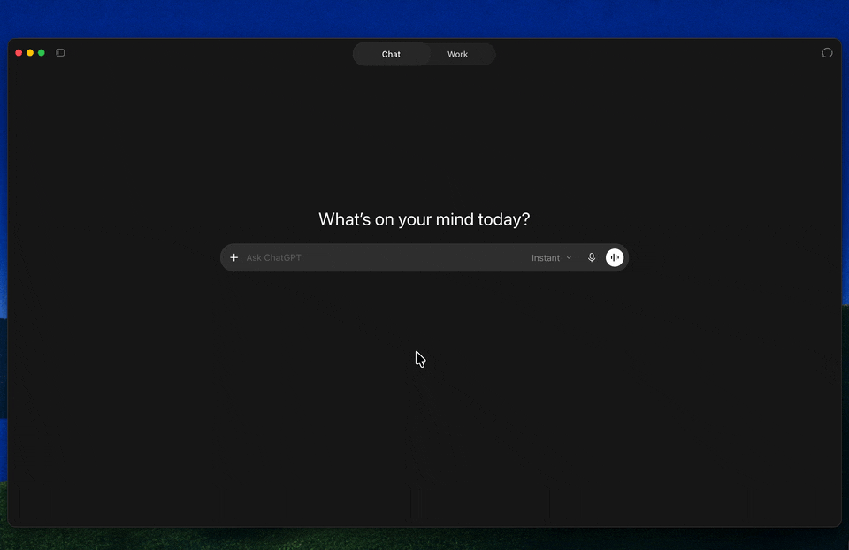
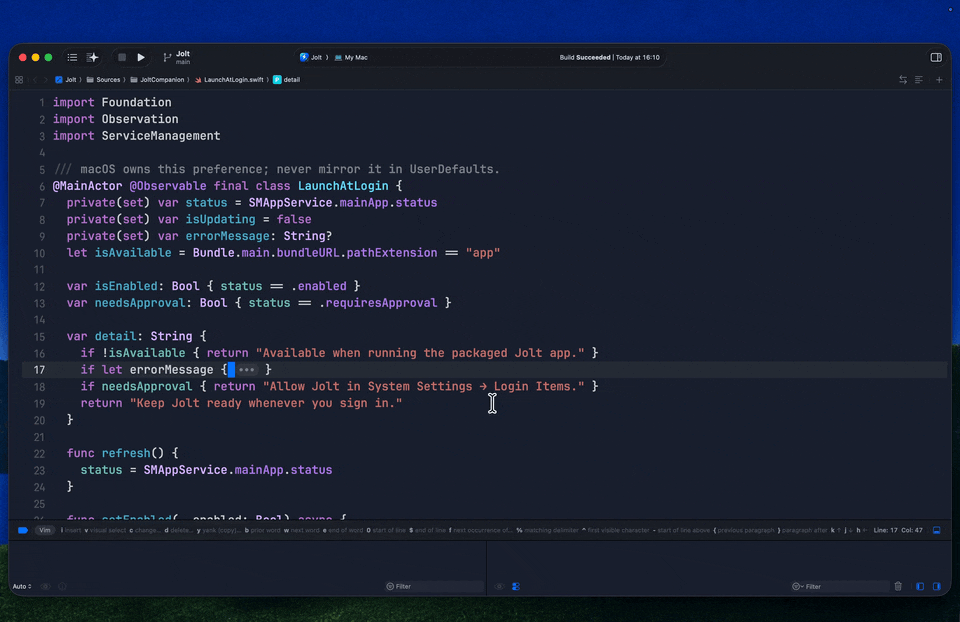
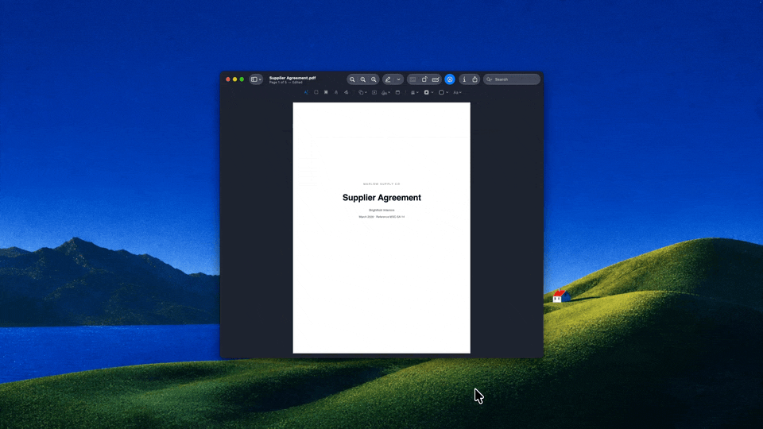
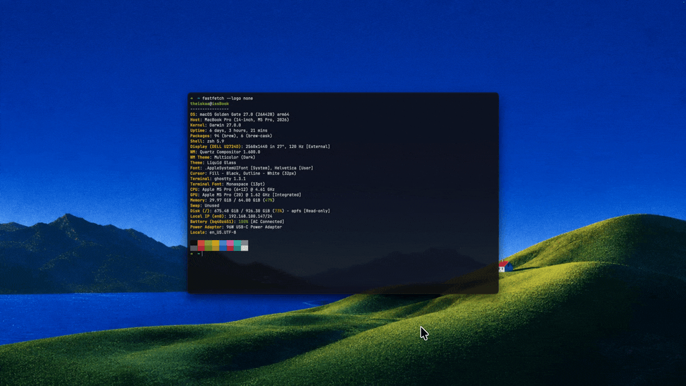
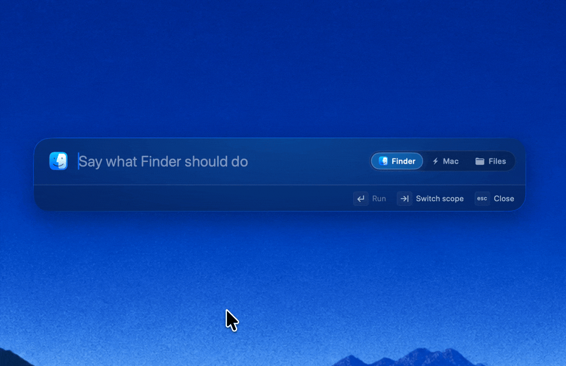
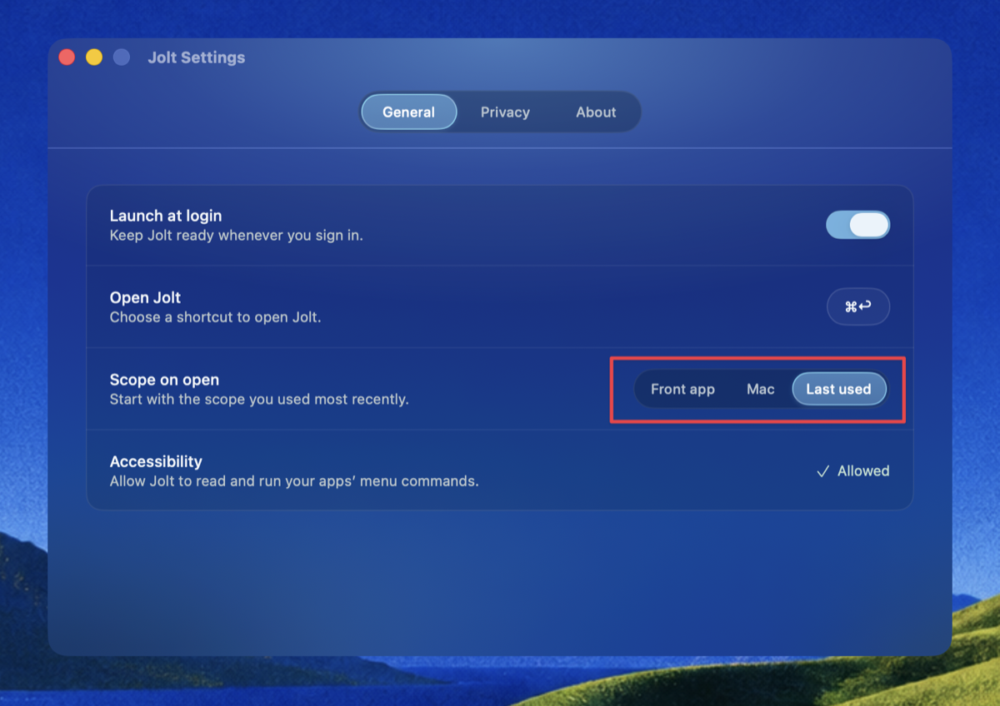
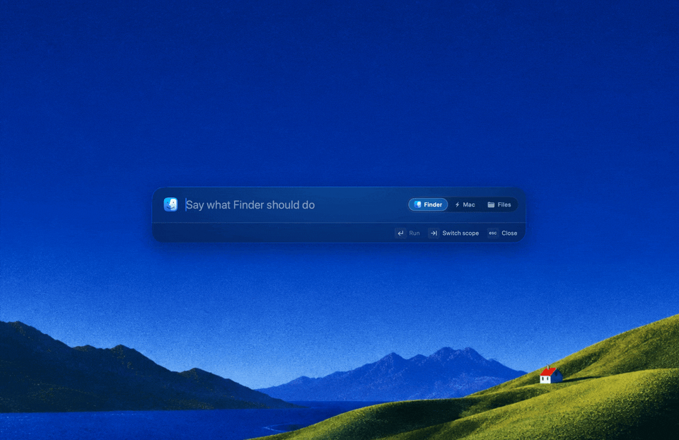

  

<h1 align="center">Jolt</h1>

  <b>The intelligent launcher for your Mac.</b>

  Not just another launcher. Jolt understands what you mean, then finds your files, 
  controls your Mac, and runs the commands of the app you are in.

  
  

  Free during the beta · macOS 14 or later · Apple Silicon · Built on <a href="https://typesafe.ai">Jev by TypeSafe</a>

  <a href="https://usejolt.app"><b>usejolt.app</b></a> ·
  <a href="CHANGELOG.md">Changelog</a> ·
  <a href="https://github.com/InsaneArts/jolt/discussions">Discussions</a> ·
  <a href="https://github.com/InsaneArts/jolt/issues/new/choose">Report a bug</a>

  

  <a href="#find-your-files">Find your files</a> ·
  <a href="#tell-your-apps-what-to-do">Tell your apps what to do</a> ·
  <a href="#control-your-mac">Control your Mac</a> ·
  <a href="#make-it-yours">Make it yours</a>

This repository is where Jolt is discussed in public: bug reports, feature requests, questions, and the changelog. Jolt's source code lives elsewhere and is not part of this repository.

## See Jolt in action

Real tasks, on a real Mac. Each demo below is a short loop; click it to watch the full video.

### Find your files

#### Find the file you mean

Remember what it is, but not what you called it? Search by name, type, date, or meaning. Find a resume, a movie, or your latest download, then preview or open it.

▶ [Watch the full demo](https://usejolt.app/demos/file-search.mp4) (1:30)

#### You choose where Jolt looks

Add the folders you want Jolt to search, including their subfolders. Remove them whenever you want in Settings → Privacy. Jolt never asks for Full Disk Access.

#### Find it. Drop it where you need it.

Find a file in Jolt and drag it straight into another app. Attach a resume to a chat, copy a file, or copy its path without opening Finder.

▶ [Watch the full demo](https://usejolt.app/demos/drag-and-drop.mp4) (0:26)

### Tell your apps what to do

#### Stay in the code

Build your project, split the editor, or open Xcode settings from Jolt. Describe what you need, even if you do not know the command's name.

▶ [Watch the full demo](https://usejolt.app/demos/xcode.mp4) (0:55)

#### Make that PDF look right

Rotate a page or change how it looks in Preview. Type what you want in Jolt, choose the command, and get back to the document.

▶ [Watch the full demo](https://usejolt.app/demos/preview-actions.mp4) (0:20)

#### A few words for your terminal

Open Ghostty's inspector, close it again, or switch to full screen. Jolt finds the app's commands while you stay in your terminal.

▶ [Watch the full demo](https://usejolt.app/demos/ghostty.mp4) (0:23)

### Control your Mac

#### The small jobs, taken care of

Launch an app, keep your Mac awake, or change a system setting. Search in the Mac tab and run the action from the same panel.

▶ [Watch the full demo](https://usejolt.app/demos/mac-actions.mp4) (1:53)

#### The next track, without the detour

Control Spotify and Apple Music from Jolt. Skip a track, resume playback, or change shuffle and repeat without opening the music app.

▶ [Watch the full demo](https://usejolt.app/demos/music-control.mp4) (0:24)

#### Light or dark. Say the word.

Switch your Mac between light and dark mode from the launcher. Jolt changes its own appearance with the rest of your Mac.

▶ [Watch the full demo](https://usejolt.app/demos/appearance.mp4) (0:26)

#### Start your search here

Search Wikipedia, Reddit, or YouTube from Jolt. Say what you want and where to look. The results open in your default browser. Search shortcuts like `!w` work too.

▶ [Watch the full demo](https://usejolt.app/demos/web-search.mp4) (0:21)

### Make it yours

<table>
  <tr>
    <td width="50%" valign="top">
      <b>Three places to look. One panel.</b> 
      Press Tab to move between commands for the app in front, actions for your Mac, and file search. The selected tab always shows where Jolt is looking.  
      
    </td>
    <td width="50%" valign="top">
      <b>A Space away from your files</b> 
      With an empty search, press Space to jump into Files. Press Backspace while the search is empty to return to the tab you came from.  
      
    </td>
  </tr>
  <tr>
    <td width="50%" valign="top">
      <b>Start where you want</b> 
      Choose what Jolt shows when you open it: the app in front, Mac actions, or the tab you last used. Set your own shortcut to open Jolt here, too.  
      
    </td>
    <td width="50%" valign="top">
      <b>A little color from the app you're in</b> 
      Move from Finder to your browser, terminal, or Slack. Jolt takes its tint from the app's icon and shows its name, so you can see which app you are controlling.  
      
    </td>
  </tr>
</table>

## Works with every app

No plugins. No setup for each app. Jolt reads what your Mac already has: the menus of the app in front, the actions your apps publish, and the panes of System Settings. A new app brings its own commands.

- **Knows which app you're in.** Jolt knows which app is in front and can run any command in its menus. Say what you want in your own words.
- **Reads the value in your words.** Say how long, how loud, or how soon. Jolt reads the value on your Mac and puts it in the command.
- **Shows you where a setting is.** Ask Xcode to "change the line spacing". Jolt opens its settings, selects Themes, and puts a ring on Line Spacing.

| In | You type | Jolt runs |
| --- | --- | --- |
| Xcode | wipe the old compiled files | Product › Clean Build Folder |
| Safari | bring back the tab I just closed | History › Reopen Last Closed Tab |
| Preview | turn this clockwise | Tools › Rotate Right |
| Spotify | skip this song | Spotify: Next Track |
| Music | put this song on repeat | Music: Song Repeat |
| Mail | any new emails? | Mail: Check For New Mail |
| Finder | make a new folder | File › New Folder |
| System Settings | my disk is full | the Storage pane |
| Mac | keep awake for 35 minutes | Keep Awake · until 4:13 PM |
| Mac | volume 20 | Set Volume · 20% |

## Why Jolt

Most commands have no keyboard shortcut. Simulator has 99 without one. Safari has 114. Xcode has 66. Stop hunting through menus — describe what you want and let Jolt find it.

<table>
  <tr>
    <td width="33%" align="center" valign="top">
      <h3>26 µs</h3>
      <b>Name matching</b> 
      Matches your typing against 219 commands.
    </td>
    <td width="33%" align="center" valign="top">
      <h3>350 ms</h3>
      <b>Plain-language understanding</b> 
      Median response from Jev. Most of that time is the network.
    </td>
    <td width="33%" align="center" valign="top">
      <h3>31 of 31</h3>
      <b>Tested accuracy</b> 
      Short queries found the correct deep command across 8 apps.
    </td>
  </tr>
</table>

The understanding comes from [Jev](https://typesafe.ai), TypeSafe's System One model. Jolt asks it one multiple-choice question whose options are every command, and reads back a probability for each. The name match never waits for it: every keystroke matches names locally in microseconds, and Jev's answer arrives about a third of a second later, on its own.

## Download

Download Jolt from [usejolt.app](https://usejolt.app), or take the `.dmg` of any version from the [releases page](https://github.com/InsaneArts/jolt/releases). Open it and drag Jolt to Applications. The `.zip` beside it is the same build in the form Sparkle installs an update in; you do not need it. Jolt is free during the beta, with no account, no license key, and no card. When the beta ends, every Mac gets a 7-day free trial.

Jolt has no Dock icon. Look for the bolt in the menu bar. Press Command-Space to open it, or the shortcut you set in Settings › General (if Spotlight still has Command-Space, change one of the two). Type, and press Return to run the row. Escape closes the panel.

A release build updates itself with [Sparkle](https://sparkle-project.org). It checks once a day, and the bolt menu has Check for Updates. The update request holds the version of Jolt and nothing about you.

## Requirements

A Mac with Apple Silicon and macOS 14 or later.

**Accessibility permission.** Jolt reads the menus of other apps through the Accessibility API and presses the item you choose, the same way a screen reader does. Allow it in System Settings › Privacy & Security › Accessibility, or with Grant in Jolt's panel or in Settings › General. Without the permission, Jolt opens on the commands of the Mac.

The first time you run an action of an app, macOS asks whether Jolt may control that app. macOS also asks before Jolt reads a protected folder. Jolt never asks for Full Disk Access.

## What leaves your Mac

- **Jolt reads the names of menu items in the app in front.** macOS asks you to allow this under Accessibility.
- **Your query and those menu names go to Jev through the Jolt backend.** Jev is a model from TypeSafe. It gets the query and a list of names. It gets no file contents, no values, and no state of your apps.
- **You choose the folders Jolt can search.** Jev sees filenames and folder names only, and only when you turn on "Find files with Jev". Add and remove folders under Settings → Privacy.
- **The private names in your menus stay on your Mac.** Recent documents, browser tabs, bookmarks, history, and open windows are found by name on your Mac. They are not sent to Jev. The switch is under Settings → Privacy.
- **Jev chooses a command. Ordinary code runs it.** No agent runs on your Mac. Jolt does not read your screen or write your queries to disk.

A query of one or two words that is the start of a name never leaves your Mac, and neither does a query shorter than three characters. Jolt stores only how often you run each command, to put your favorites first. You can turn that off and clear it under Settings → Privacy.

## Getting help

- **Something is broken** → [open a bug report](https://github.com/InsaneArts/jolt/issues/new/choose)
- **Jolt found the wrong command** → [report the query](https://github.com/InsaneArts/jolt/issues/new/choose), with the row you expected
- **Something is missing** → [open a feature request](https://github.com/InsaneArts/jolt/issues/new/choose)
- **A question, or an idea to talk through** → [Discussions](https://github.com/InsaneArts/jolt/discussions)
- **A security issue** → [SECURITY.md](SECURITY.md), not a public issue

[CONTRIBUTING.md](CONTRIBUTING.md) says what makes a report easy to act on.
